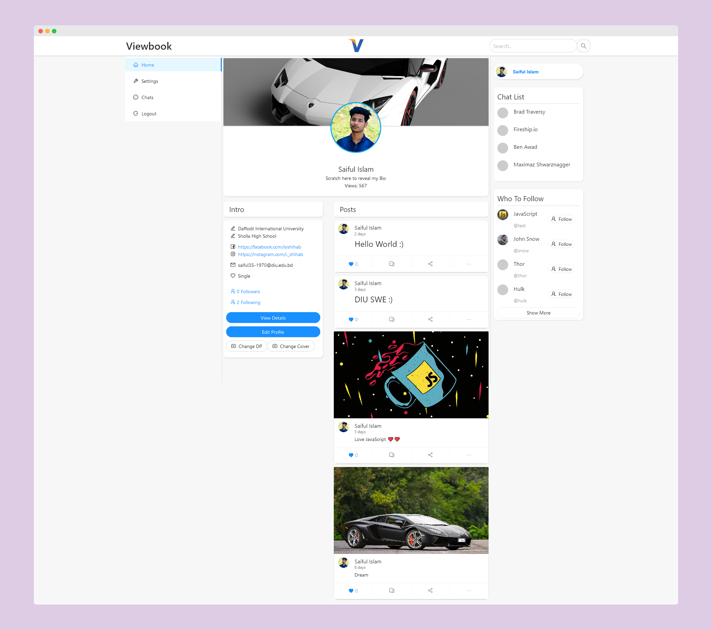

# View Book

A social media app.
## Screenshots
(https://www.behance.net/gallery/107567413/Social-Media-Website-build-with-MERN-stack)


## Prerequisites
```javascript

nodejs
npm
```
## Installation
```javascript
cd /project-folder
npm install

cd /client
npm install
```
## Usage
```
npm run server    // run server
npm run client    // run client side
npm run dev       // run both server & client concurrently
```
#### Create a .env file in root folder & fill it as below
```
SecretKey= secret key for jwt (ex- 12345fghhj)
NODE_ENV=development
PORT=5000
MONGO_URL= your mongodb connection string
```
## LICENSE
Licensed under the [MIT License](LICENSE)

Show some ❤️ by clicking the ⭐ button.
